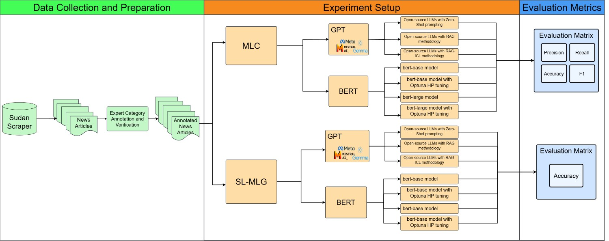

# Comparative Analysis of BERT and GPT for Classifying Crisis News with Sudan Conflict as an Example 🚀

<p align="center">
  📄 <a href="xxx" target="_blank">Paper</a> &nbsp;  &nbsp;
</p>

<p align="center">  </p>

## Updates

## Table of Contents 📌
- [Overview](#overview) 🔍 
- [Key Results](#key-results) 📊
- [Model Zoo](#model-zoo) 🏛️
- [Quick Start](#quick-start) 🚀
- [License](#license) 📜
- [Citation](#citation) 🔖

## Overview 
This project compares Multi-Label Classification (MLC) and Single-Label Classification from Multi-Label Ground Truth (SL-MLG) for conflict-related news using BERT and GPT-based large language models (LLMs). The evaluation includes:

- Fine-tuned BERT models (standard and hyperparameter-tuned)
- GPT models using Zero-shot, Retrieval-Augmented Generation (RAG), and RAG with In-Context Learning (ICL)

## Key Results  
### **MLC Collective Experimental Results**
| Algorithm       | Model             | Runtime   | F1-score   |
|-----------------|-------------------|-----------|------------|
| **RAG ICL**     | Llama3.1-70b      | 3m 30s    | 67.00%     |
| **RAG**         | Llama3.1-70b      | 2m 30s    | 68.80%     |
| **Zero-Shot**   | Llama3.3-70b      | 1m 31s    | 62.75%     |
| **BERT (tuned)**| bert-base-uncased | 187m 45s  | 63.01%     |
| **BERT (tuned)**| bert-large-uncased| 1350m 55s | **68.90%** |
| **BERT**        | bert-base-uncased | 9m 43s    | 62.85%     |
| **BERT**        | bert-large-uncased| 14m 55s   | 54.62%     |


### **SL-MLG Collective Experimental Results**
| Algorithm       | Model             | Runtime   | Accuracy   |
|-----------------|-------------------|-----------|------------|
| **RAG ICL**     | Llama3.3-70b      | 3m 12s    | **90.70%** |
| **RAG ICL**     | Llama3.1-70b      | 3m 14s    | **90.70%** |
| **RAG**         | Llama3.3-70b      | 1m 44s    | 86.05%     |
| **Zero-Shot**   | Llama3.3-70b      | 40s       | 76.74%     |
| **BERT (tuned)**| bert-base-uncased | 145m 18s  | 74.42%     |
| **BERT (tuned)**| bert-large-uncased| 1243m 28s | 83.72%     |
| **BERT**        | bert-base-uncased | 9m 39s    | 76.74%     |
| **BERT**        | bert-large-uncased| 28m 31s   | 74.42%     |


## Model Zoo 

| Model Type | Models Used |
|------------|------------|
| **BERT**  | `bert-base-uncased`, `bert-large-uncased` |
| **GPT (Open-Source LLMs)** | `Llama3.1-70b`, `Llama3.3-70b`, `Gemma2-9b`, `Gemma2-27b`, `Mistral-7b`, `Llama3.2-3b`, `Llama3.1-7b` |


## Quick Start 

### **1️⃣ Initial Setup**

```bash
git clone https://github.com/yahya3867/Comparative-Analysis-of-BERT-and-GPT-for-Conflict-Related-MLC-from-Multi-Label-Ground-Truth.git
cd Comparative-Analysis-of-BERT-and-GPT-for-Conflict-Related-MLC-from-Multi-Label-Ground-Truth
```

Create a Python virtual environment and install the required dependencies for both **GPT** and **BERT** training.

```bash
# Create a virtual environment
python -m venv ClassificationVenv

# Activate the environment
# Windows:
ClassificationVenv\Scripts\activate
# macOS/Linux:
source ClassificationVenv/bin/activate

# Install dependencies
pip install -r GPT/requirements.txt
pip install -r BERT/requirements.txt
```

### **2️⃣ Install LM Studio and Select Models**

1. **Download and install** [LM Studio](https://lmstudio.ai).
2. **Open LM Studio** and go to the **Discover** tab.
3. **Install the required LLMs**, including:
   - `Llama3.1-70b`
   - `Llama3.3-70b`
   - `Gemma2-9b`
   - `Gemma2-27b`
   - etc.
4. **If not pre-installed**, download an embedding model such as:
   - `nomic-ai/nomic-embed-text-v1.5-GGUF`

5. **Load the models:**
   - Navigate to the **Developer** tab.
   - Click **"Select a model to load"** and choose both:
     - The **LLM**
     - The **Embedding Model**

6. **Verify model status:**
   - Ensure **Status: Running** before proceeding.

### **3️⃣ Run LLM Classification**
```bash
# Example Usage: 
code GPT/scripts/MLC/MLC_RAG.ipynb # RAG methodology for MLC
```
### **4️⃣ Run BERT Classification**
```bash
# Example Usage: 
code BERT/scripts/MLC/MLC_bert_train.ipynb # BERT training script for MLC
```
### 5️⃣ Evaluate LLM Performance
```bash
# Example Usage: 
python GPT/scripts/MLC/MLC_eval.py # GPT evaluation script for MLC
```

## License
This project is licensed under the **MIT License** – see the [LICENSE](LICENSE) file for details.

## Citation

```
@article{Wang2025gptbert,
  title     = {Comparative Analysis of BERT and GPT for Conflict-Related Multiclass Label Classification from Multi-Label Ground Truth},
  author    = {Zifu Wang and Yahya Masri and Anusha Srirenganathan Malarvizhi and et al.},
  year      = {2025},
  note      = {Manuscript in preparation, not yet submitted}
}
```

